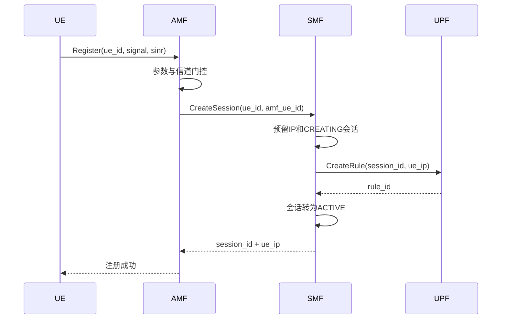
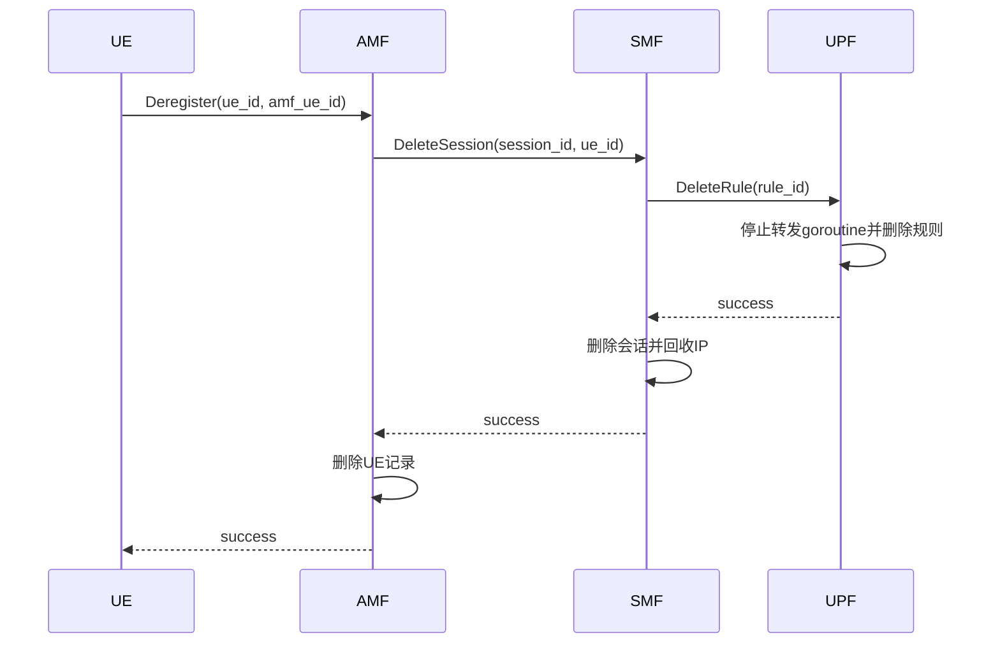

# LiteCore 架构说明

## 1. 项目定位

LiteCore抽取5G核心网中最容易用于教学和软件实验的控制流程，以gRPC代替复杂的3GPP接口协议。研究重点是核心网元间的状态传递、并发处理、错误传播、控制面延迟和故障表现。

## 2. 模块职责

### UE

通过`ChannelModel`接口产生`ChannelSample`。模型的唯一职责是计算信号功率和SINR两个数，不包含接入门限；可以在不修改注册流程的情况下换成导师模型。批量模式并发创建UE，并单独统计成功注册的端到端延迟。

### AMF

验证UE参数和首次注册时的信道质量，维护`REGISTERING`、`REGISTERED`、`DEREGISTERING`状态，调用SMF建立或释放会话。阈值为信号功率不低于-110 dBm且SINR不低于0 dB。门限只用于首次接入；本教学系统没有注册后的信道测量或踢下线功能。

### SMF

维护会话、UE映射和IP池；调用UPF创建与删除规则。每次创建带有内部代次，跨服务调用返回后必须确认仍是同一次操作才可提交或回滚；`CREATING`会话不允许并发删除。

### UPF

维护会话对应的模拟转发规则，并由goroutine周期性增加包计数。默认每秒增加10个包，即名义模拟速率10包/秒；这不是实际网络吞吐量。删除规则或服务退出时会取消并等待对应goroutine。查询响应使用`found`明确区分“不存在”和“计数恰好为零”。

## 3. 注册时序

CreateSession或CreateRule失败时，错误向上返回；SMF只回滚本次操作预留的会话和IP。重复注册返回已有资源，不重复分配。AMF到SMF的DNN固定为`internet`。

## 4. 注销时序

删除接口是幂等的：资源已经不存在时仍返回成功。资源存在时必须核对`amf_ue_id`或`ue_id`，避免用一个设备的标识删除另一个设备的资源。

## 5. 可靠性设计

- 所有跨服务调用使用3秒超时；UE单次尝试使用4秒超时。
- UE对`Unavailable`、`Aborted`和`DeadlineExceeded`等瞬态注册错误最多自动重试2次，并把实际重试次数写入CSV。
- gRPC错误保留`Unavailable`、`Aborted`、`InvalidArgument`等语义；AMF对下游失败统一向UE暴露`Unavailable`。
- AMF、SMF、UPF内部状态由RWMutex保护。
- 创建接口检查既有资源和所有者字段，避免重复创建或错误复用。
- UPF失败时SMF执行补偿回滚。
- 服务支持SIGINT/SIGTERM优雅退出，最多等待5秒后强制停止。
- 服务注册了gRPC标准健康服务，供人工或未来集成调用；当前Docker和Kubernetes实际使用TCP端口探测。
- benchmark只用成功请求计算平均延迟和P50/P95/P99/最大值；失败率单独报告。CSV写完后会批量注销成功注册的UE并报告清理失败数。

## 6. 已知限制

- AMF、SMF和UPF状态都只在内存中，任一服务单独重启都可能让服务间记录失配。实验规程把重启定义为整栈重启。
- Kubernetes清单刻意保持三个服务均为单副本。故障实验只验证进程能被重新拉起，不代表状态无损高可用。
- 并发的相同UE请求在第一次创建尚未完成时会收到可重试错误；客户端会在上限内自动重试。
- UPF可能已创建规则但回复在链路中丢失。系统没有后台清扫或持久化事务，不能保证自动删除这类不确定规则；后续请求会检测参数冲突而不会静默绑定到错误IP。实验报告必须将其列为已知限制，不能宣称“重试必然自愈”。
- UPF不处理真实IP包。
- 阈值是实验参数，不代表3GPP标准要求。
- 没有鉴权、加密、用户数据库和标准服务发现。
